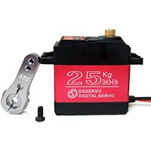

# Pierin-oh!

## Brief description

Pierin-oh! is a desktop application for manoeuvring a robotic arm with six degrees of freedom (6DOF).

The arm's joints (shoulder, elbow, wrist and clamp) can be moved through:

* sliders and buttons present in the GUI;
* game controllers;
* face recognition (still limited and performing poorly);
* code made in the Pierin-oh! programming language (don't get too excited, it's composed by a sequence of simple, limited commands).

At present, programs are executed directly into the user interface. Maybe, in future releases, it will also run in a CLI (Command Line Interface).

## Just to make things clear

I have a basic understanding of servo motors and electronics, so I am not an expert.  I have been a software developer and wanted to have some fun in my free time. You should take this as a log of my little experiments.

## Fast start-up

I have done as much as I could to render easy a fast start with the software.

The main steps to be quickly up and running are:

* get a 6 DOF arm or its parts and assemble it, see more below;
* get 5 MG 996R servo motors and a 25kg torque one (see below);
* get an [Arduino Nano](https://store.arduino.cc/arduino-nano) (or compatible) microcontroller;
* for easy cabling, I also suggest to get an Arduino Nano expansion shield;
* get a [PCA9685 16-Channel Servo Driver](https://learn.adafruit.com/16-channel-pwm-servo-driver?view=all);
* assemble all the above stuff as explained below;
* if you haven't already done so, download and install the latest [Arduino Software (IDE)](https://www.arduino.cc/en/software). They won't get upset if you donate some quid/bucks to them ;)
* using the Arduino Software, compile and upload  the code you'll find in the /src/main/ino folder of this project;
* download the latest [Java JDK](https://www.oracle.com/java/technologies/javase-downloads.html). I used version 13.
* use [Maven](https://maven.apache.org/) or your preferred IDE for compiling the Java code in the /src/main/java folder. I use [Apache NetBeans](https://netbeans.org/).

If all the above has been done, now we should have:

* a robotic arm assembled with its servo-motors, mounted and lots of wiring, coming from the servos, that goes to the PCA9685 shield. I strongly recommend not to leave the wires loose but to use some cable ties for grouping and fixing wires along the arm, testing and making sure that all of them are long enough when the arm stretches, bends or rotates and that they won't be cut by the joints when they make acute angles (like scissors). You want to use some [servo motor cable extensions](https://www.amazon.com/s?k=servo+cable+extension) too. On this subject, spiral tubes would be a nifty solution, but I did not try them yet;
* on its turn, the PCA9685 shield connected to the Arduino Nano;
* the microcontroller already programmed and attached to your PC through one of the available USB ports;
* the PCA9685 shield powered by an external 5V power supply with, at least, 2.5A: do not even think of using the power coming from a USB port of the PC to power-up the shield!

Now you should be ready and start the Pierin-oo! program. Once running, you should see a graphical user interface with tabs. In the second one, there is the default configuration for the serial port. And, if already detected, you should see the serial port name where the arm is connected to. If not, attach the arm (the Arduino Nano) to one of the USB ports and press the refresh button. Chances are it's the only serial port connected to your PC if not, select the correct one from the "Port name" combo-box. Stand clear from the reaches of the arm, including your PC, monitor and anything else that could be damaged by an unexpected and wildly fast movement of the arm and hit Connect.

Enjoy!

## Robotic arm parts

The arm I used for this project is made of aluminium, and its parts can be acquired separately on the market or bought as a kit.  My choice was to buy the mechanical parts in a single kit, and servo motors and the other bits apart. If you look for "6dof robot arm" in one of the major vendor websites you should be able to find the same as mine.

As mentioned above, the arm itself is governed by an [Arduino Nano](https://store.arduino.cc/arduino-nano) that uses a [PCA9685 16-Channel Servo Driver](https://learn.adafruit.com/16-channel-pwm-servo-driver?view=all) to control all servo motors. The servos themselves are [MG 996R](https://www.amazon.com/s?k=MG+996R+servo&ref=nb_sb_noss_2) compatible, except for the one used to vertically move the shoulder, which is a [25kg torque servo](https://www.amazon.com/s?k=25kg+torque+servo) that is a bit more expensive but, in my opinion, necessary to lift the arm which weighs almost 1kg (about 2 lbs).

The MG 996R usually ships with plastic horns. I suggest using [metal horns](https://www.amazon.com/s?k=MG+996R+metal+horns). The clamp I am using does not fit with the metal horns, so I used a plastic one.

Let's compile a list of the parts I used.

<table>
  <thead>
    <tr>
      <th>
        Part
      </th>
      <th>
        Qty
      </th>
      <th>
        Image
      </th>
    </tr>
  </thead>
  <tbody>
    <tr>
      <td><a href="https://www.amazon.com/s?k=Aluminum+robotic+Claw+clamp" title="Opens amazon.com" target="_blank">Clamp</a></td>
      <td style="text-align:right">1</td>
      <td></td>
    </tr>
    <tr>
      <td><a href="https://www.amazon.com/s?k=robot+U-Shaped+Beam+Bracket" title="Opens amazon.com" target="_blank">U-Shaped Beam Bracket</a></td>
      <td style="text-align:right">3</td>
      <td></td>
    </tr>
    <tr>
      <td>Multi-functional servo bracket</td>
      <td style="text-align:right">5</td>
      <td></td>
    </tr>
    <tr>
      <td>Long U-type servo bracket</td>
      <td style="text-align:right">3</td>
      <td></td>
    </tr>
    <tr>
      <td>L-type servo bracket</td>
      <td style="text-align:right">1</td>
      <td></td>
    </tr>
    <tr>
      <td>Metal horn 1</td>
      <td style="text-align:right">5</td>
      <td></td>
    </tr>
    <tr>
      <td><a href="">MG996R Servo Motor</a></td>
      <td>5</td>
      <td></td>
    </tr>
    <tr>
      <td>25kg digital servo motor high torque</td>
      <td>1</td>
      <td></td>
    </tr>
  </tbody>
</table>

1 There are six servos, but the clamp does not fit a metal horn so, for that one, I use a plastic one. 

## The boards and electrical and electronic parts

<table>
  <thead>
    <tr>
      <th>
        Part
      </th>
      <th>
        Qty
      </th>
      <th>
        Image
      </th>
    </tr>
  </thead>
  <tbody>
    <tr>
      <td>Arduino Nano</td>
      <td style="text-align:right">1</td>
      <td></td>
    </tr>
    <tr>
      <td>Arduino Nano expansion board</td>
      <td style="text-align:right">1</td>
      <td></td>
    </tr>
    <tr>
      <td>PCA9685</td>
      <td style="text-align:right">1</td>
      <td></td>
    </tr>
    <tr>
      <td>Female DC Power Plug Connector (2.5mm x 5.5mm) 2</td>
      <td style="text-align:right">1</td>
      <td></td>
    </tr>
  </tbody>
</table>

2 For the PCA9685 is required an external power supply, and the one I used has the male connector with 2.5mm x 5.5mm. Make sure you get a female connector of the right size. <strong><u>Do not use USB ports to power the PCA9685 board</u></strong>.

## The wiring

The wiring is fairly simple, especially when an Arduino Nano expansion shield is used (highly recommended).

I suggest using a crimper for Dupont connectors for making your own cables of the right length, the number of pins and reliability.

You will need some extensions for the servos as their cables are too short for the arm length.  No need to make them: they can be bought online.

## The Java package structure

## How it works

There are eight main components:

### The 6 DOF Arm Controller (SixDOFArmController class)

This is the very heart of the software that governs the arm.

It expects to have a user interface (UI) to which send the default settings, serial ports and game controllers availability. The UI is also used to receive user preferences and commands from pointing devices (mice, trackballs, sticks, etc.) and send feedback from the arm.

It does not make any assumption on the UI which could be a graphical one (GUI), textual or, for instance, an HTTPS server.

Also, it does not know anything about the underlying face-recognition system as well as game controllers or mice. It implements some listeners for those purposes, and it is not bound to any specific library.

### The Graphical User Interface (SixDOFArmControllerGUI class)

It is developed using Swing, which is not 'hot', but it does well its work. I know it isn't a modern looking interface: if there are volunteers to make it look better, they are welcome!

This interface also takes care to send the mouse input to the Pointer Controller, and it is done through the AWT library.

The GUI has an interface to a SixDOFArmController but does not know anything about the underlying implementation.

### The Game Controller (GameController class)

It merely receives the game controllers input and forwards it to the Pointer Controller.

It wraps up the JInput library.

### The Serial Communicator (SerialCommunicator class)

The Serial Communicator takes care of the communication between the arm and the program. It relays on JSerialComm which proved itself very easy to use. As explained later on, the Arm Controller creates a Serial Communicator and passes its reference to a Dispatcher which cares of verifying the execution of commands by the robotic arm through a mechanism that comprises IDs and acknowledgement messages.

### The Face-Recognition Device (FaceRecognitionDevice class)

It wraps up the OpenCV library and passes the centre of the rectangle identified in the face-detection process to the Arm Controller which moves the arm accordingly.

### The Collision Detector (Collision Detector class)

Before executing a command, the Arm Controller passes it to the Collision Detector that calculates where the clamp's tip would be if that command were actually executed. If acting as required, the clamp would hit the arm itself or go below the plane where the arm lays on. In case of a possible collision, the detector notifies it to the Arm Controller that does not execute the command and warns the user.

### Pierin-oh! Language (PierinhoLanguage class)

The Pierin-oh! Language is a trivial interpreter that receives in input a list of commands and sends them, one by one to the Arm Controller.  For the time being, it does not allow any kind of loop, conditional statement or variable.

In case of wrong or unknown commands or collision detection, the program aborts with an error.

### The Dispatcher (Dispatcher class)

The Arm Controller creates a Serial Communicator that handles the communication with the robotic arm through a defined serial port. However, it does not send the commands directly to the Serial Communicator.  Instead, it creates a Dispatcher to which it sends all commands.  On its turn, the Dispatcher attaches a unique ID to each command and sends them to the Serial Communicator.

The robotic arm on receiving the commands returns an acknowledgement with the same ID. On receiving an acknowledge message, the Dispatcher checks whether all commands have been executed in the proper order. If in an acknowledge message the Dispatcher reads an ID, and it did not receive one or more of the previous ones, it takes for granted that the commands relative to those IDs have not been executed and informs the Arm Controller.

### Class Diagram Relationship

## Instructions manual

Yet to be done.
